# Tray Games

Seven games that live inside tray-icon right-click menus, plus a launcher that
summons them.

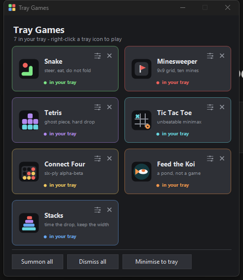

## Run it

```bash
dotnet build -c Release && build/TrayGames.exe
```

Click a card to summon that game; it appears as its own tray icon. Right-click
the icon to open the menu and play. The ✕ on a running card dismisses it, and
the sliders button opens that game's settings.

**Minimise to tray** folds the launcher itself into a tray icon. Right-clicking
it gives a bare list — icon and name, nothing else — where clicking a game
toggles it: summon if it is not running, dismiss if it is. Games currently in
your tray carry a green outline, and the list stays open as you toggle, so the
outlines are the feedback. Left-clicking the icon brings the window back.

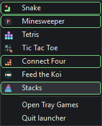

On Windows 11 new tray icons start hidden behind the `^` chevron — drag the ones
you want onto the taskbar to keep them visible.

## Settings

Every game carries its own options in its menu, showing the current value
inline. Changing one applies immediately, restarts the round, and writes to
`%APPDATA%\TrayGames\<Game>.settings` — on the spot and again on exit, so a game
always reopens the way you left it.

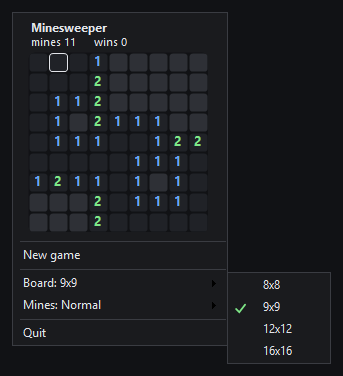

The same options are in the launcher, behind the sliders button on each card,
including for games that are not running:

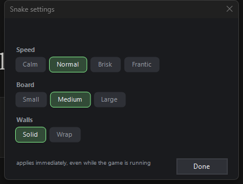

The launcher does not know what a game's options *are*. It runs the game with
`--dump-settings` for a fraction of a second and reads the list back, which
keeps each game the single source of truth for its own settings rather than
duplicating a schema that could drift. Changes are written to the same file the
game writes, and a running game notices the edit within about a second and
applies it without being restarted — so you can retune the pond while watching
the koi.

| game | options |
|---|---|
| Snake | Speed (Calm → Frantic), Board (Small / Medium / Large), Walls (Solid / Wrap) |
| Minesweeper | Board (8x8 → 16x16), Mines (Few / Normal / Many — 10%, 14%, 19% density) |
| Tetris | Start level (1 / 4 / 7 / 10), Well (Narrow / Normal / Wide), Ghost piece |
| Tic Tac Toe | Opponent (Careless / Casual / Sharp / Perfect), First move |
| Connect Four | Opponent (Careless / Casual / Sharp / Ruthless), First move |
| Feed the Koi | Starting koi (1 / 3 / 5 / 8), Pond holds (6 / 9 / 12), Liveliness |
| Stacks | Start speed (Slow → Blistering), Start width, Perfect snap tolerance |

Board size is a real setting, not a zoom: the cell size follows the grid so a
16x16 minesweeper still fits a tray menu, and the menu resizes around it.

### How the opponents weaken

Tic tac toe is small enough that a shallower search is still perfect, so
strength is a chance of throwing the move away instead. Measured over 300 games
against a plausible casual human — takes the win, blocks the loss, otherwise
plays at random:

| opponent | human wins | draws | human losses |
|---|---|---|---|
| Careless | 163 | 112 | 25 |
| Casual (default) | 98 | 149 | 53 |
| Sharp | 32 | 220 | 48 |
| Perfect | **0** | 250 | 50 |

Connect four has room for depth to matter, so it uses both: 2 ply with a 40%
blunder rate up to 8 ply with none. Careless against Ruthless, head to head over
six games, ended 0–6.

## The games

| | | |
|---|---|---|
| 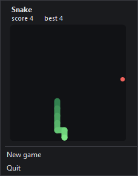 | **Snake** | Arrows / ZQSD / WASD. Space pauses. Clicking the board steers too. |
| 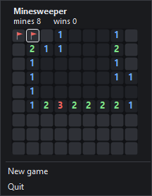 | **Minesweeper** | Left-click reveals, right-click or shift-click flags, `F` flags under the keyboard cursor. The first click can never be a mine. |
| 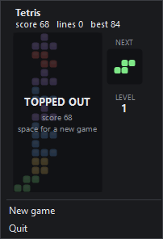 | **Tetris** | Arrows move and rotate, space hard-drops, `P` pauses. Ghost piece, next-piece panel, speed rises every five lines on top of the start level. |
| 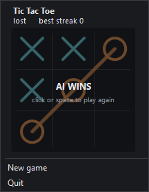 | **Tic Tac Toe** | Full minimax. At *Perfect* a draw is the ceiling, and the status line tracks your unbeaten streak. |
| 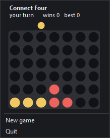 | **Connect Four** | Alpha-beta with centre-first move ordering, searched off the UI thread so the menu never freezes. |
| 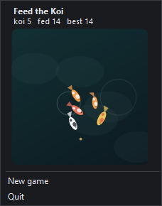 | **Feed the Koi** | Not a game: click the water to drop food, koi steer toward it, and a well-fed pond hatches more koi. Nothing to lose. |
| 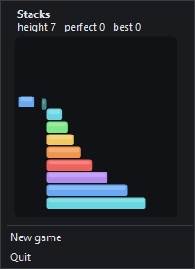 | **Stacks** | Space or click to drop the sliding block. Overhang is trimmed away; a near-perfect drop snaps and keeps the full width. |

Best scores live beside the settings, one file per game.

## One process per game

Each game is a separate executable with its own tray icon, timers, settings and
save file. The launcher never loads a game assembly — it knows only a filename
and a process name, and starts or kills it. A wedged AI or a runaway timer can
only take down its own game, and two games can never collide over state.

The cost is a little duplication: the launcher redraws its own small icons
rather than importing each game's real one, because importing them would mean
loading all seven assemblies into the launcher just to fill 40 pixels.

```
TrayGames.Core/      shared: tray host, menu chrome, theme, settings, self-test
Games/<Name>/        one WinExe each: rules, painting, input, its own options
Launcher/            the window above; references Core only
build/               every project outputs here so the launcher finds siblings
```

## How a game gets inside a menu

A native Win32 tray menu is an `HMENU`, not a window. Drawing into one means
owner-drawn items (`MFT_OWNERDRAW` + `WM_DRAWITEM`), and `TrackPopupMenu` runs a
modal loop that swallows the keyboard, so input needs a `WH_MSGFILTER` hook and
a manual `InvalidateRect` on the `#32768` menu window.

WinForms sidesteps that. A `ContextMenuStrip` is a `ToolStrip` built from real
controls, so `ToolStripControlHost` can host an ordinary `Control`. Each game is
a `GameControl`: double-buffered, with its own timer and key handling, sitting
between two menu separators.

Four things are load-bearing, all in `TrayGames.Core`:

- `GameControl.ProcessCmdKey` claims arrows and space before the ToolStrip can
  use them for menu navigation. Every game claims the arrows even if it does not
  need them, because an unclaimed arrow moves the ToolStrip's own selection and
  pulls focus off the board.
- `menu.Opened` calls `SetForegroundWindow`. Without it the dropdown is visible
  but not active, and keystrokes go to whatever window was focused before.
- `menu.Closed` suspends the game, so dismissing the menu never costs a run and
  no game keeps a 30fps timer running in the background.
- `menu.Closing` cancels the dismissal that follows a settings click, so several
  options can be changed in one visit.

A third quirk, found the same way: for a **top-level** menu item the dropdown's
`Closing` fires *before* `Click`, while for a submenu item it fires after. A
keep-open flag set inside a click handler therefore works in the game menus and
silently fails in the tray list; the tray list arms its guard on `MouseDown`
instead. Dismissing a game also blocks briefly while the process exits, and the
foreground moves while it does, so the guard has to cover `AppFocusChange` and
not just `ItemClicked`.

Two more quirks worth knowing if you extend this. Nested dropdowns are built by
`ToolStripManager`, not by the strip that owns them, so a renderer set only on
the context menu leaves every submenu stock-white; the manager's renderer is set
once at startup. And right-clicking inside the dropdown works and does not
dismiss it — verified, not assumed, because it was the one interaction worth
doubting.

## Verifying it

Screen-automation tooling cannot resolve an unsigned local exe by name, and a
tray-only process owns no window for it to find. So each game proves itself:

```bash
build/TrayGame.Minesweeper.exe --selftest C:/some/output/dir
build/TrayGames.exe --selftest C:/some/output/dir
```

The harness opens the real dropdown, injects real keystrokes and mouse clicks
through `keybd_event` / `mouse_event`, and photographs the dropdown at each
stage. Driving the control's handlers directly would prove nothing: the open
question is always whether the ToolStrip hands input to a hosted control at all,
and only events travelling the full injection → message pump → ToolStrip path
answer it.

Every game also runs a shared settings check: open the first submenu, click an
option with a real mouse click, then confirm the value changed, the menu
survived the click, and the choice reached disk.

What the last run showed:

| game | checked |
|---|---|
| Snake | grew to score 4 under a greedy driver, wrote the high score |
| Minesweeper | right-click flagged without dismissing the menu; `F` flagged via the keyboard cursor |
| Tetris | pieces moved, rotated and locked under live gravity; a seeded full row cleared on the next lock (lines 0 → 1) |
| Tic Tac Toe | took the centre, blocked the top row, then won on the anti-diagonal; difficulty curve measured over 4×300 games |
| Connect Four | blocked a human three-in-a-row at the only column that mattered, then won; Careless lost 0–6 to Ruthless |
| Feed the Koi | a fish closed 40px → 23px on a dropped pellet in 0.7s, ate it, and the pond hatched new koi |
| Stacks | 34 blocks, widths narrowing 110 → 5.5, perfect drops preserving width |
| all seven | settings submenu opened, click applied, menu stayed open, value persisted |
| all seven | a settings file edited by another process was picked up and applied live |
| Launcher | summoned all seven as distinct PIDs, then dismissed all seven |
| Launcher | read Snake's options over `--dump-settings`, wrote a change while it ran |
| Launcher | minimised to tray, listed 7 games with icons, restored |
| Launcher | tray list toggled a game off and back on, list stayed open, outline followed (`#7EE787` → background → `#7EE787`) |

Three caveats worth knowing:

- The play-through part of each game's run sets `AutoClose = false`, because
  anything taking the foreground closes a normal dropdown mid-run and a script
  cannot prevent that. Auto-close behaviour is checked separately, before it is
  switched off.
- The Tetris driver tops out quickly. Gravity keeps running between injected
  keystrokes, so it is playing at roughly 25 keys per second against a live
  clock — that is a limit of the harness, not the game.
- `CopyFromScreen` can capture a just-shown menu before compositing finishes,
  which looks exactly like a theming bug. `ProbePixel` reads a single screen
  pixel to tell the two apart.

`--dev` on any game shows a plain window beside its tray icon; it exists only so
the process is visible to tooling that ignores windowless processes.

## Related

Snake started life as a standalone tray app, built before any of this existed,
to answer one question: can a real game live inside a tray menu at all? The
Snake in this suite is that same game ported onto the shared core.
